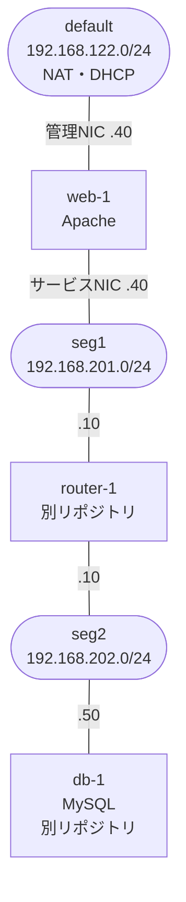

# minivps-web-appliance

[mini-vps-platform](https://github.com/0x69d/mini-vps-platform)上で、seg1にweb層を提供するWebアプライアンスVM用のゴールデンイメージ・VM spec・ゲスト内設定一式。

## これは何のためのリポジトリか

mini-vps-platformにはこれまで、実際のワークロードを載せて層ごとにセグメントを分ける構成の実例が無かった。本リポジトリは[minivps-db-appliance](https://github.com/0x69d/minivps-db-appliance)と対になり、web層(seg1)とDB層(seg2)をrouter-1で分離して、web層からしかDBに到達できない構成を実現する。

web-1が担うのはApacheの稼働と、db-1への接続元であること。サイトの中身は載せず、Apacheは既定のウェルカムページのまま置く。ゴールデンイメージにはApacheのほかMySQLクライアント(`mysql-client-core`)を焼き込む。minivps-db-applianceのREADMEがdb-1への疎通確認をweb-1から行うよう案内しており、クライアントが無いとその手順を実行できないため。

## 前提条件

- mini-vps-platformがセットアップ済み(`~/.ssh/minivps_ed25519.pub`公開鍵、`seg1`ネットワーク、`images`ストレージプール、`ubuntu-26.04.img`が`images`プールに存在すること)。
- db-1へ接続する場合は、[minivps-router-appliance](https://github.com/0x69d/minivps-router-appliance)のrouter-1が稼働し、3306の許可ルールが追記されていること([router-1側の許可ルール](#router-1側の許可ルール)参照)。あわせてホストで`net.bridge.bridge-nf-call-iptables`が0であること(理由はminivps-db-applianceのREADME「送信元IPの保存」)。
- `tests/check-apache-conf.sh` を回す場合はホスト側に `apache2`。

## アーキテクチャ



| ネットワーク | CIDR | web-1のIP | 用途 |
|---|---|---|---|
| default | 192.168.122.0/24 | 192.168.122.40 | 管理(SSH) |
| seg1 | 192.168.201.0/24 | 192.168.201.40 | HTTP提供・db-1への接続元 |

web-1はseg1への単一配置とし、db-1(192.168.202.50)へはrouter-1経由で到達する。このためspecにseg2宛の`static_routes`(via 192.168.201.10)を宣言している。db-1側にも対称の戻り経路がある。

受信制御: specの`filters`は未設定とし、router-1/dns-1と同様、ゴールデンイメージに焼き込んだゲスト内nftablesのinput chainが受信制御を担う。80/443は送信元を問わず、22/tcpは管理ネット(192.168.122.0/24)からのみ許可、診断用ICMP許可、他はデフォルト拒否。

名前解決は管理NICの`nameservers`でdefaultセグメントのlibvirt dnsmasqを指定している。全NICが静的だとnetplanがリゾルバを持たず、運用者がaptを叩けなくなるため。dns-1(`minivps.internal`)の参照は設定していない。必要になったら[minivps-dns-appliance](https://github.com/0x69d/minivps-dns-appliance)のクライアント設定手順に従う。

## クイックスタート

1. ゴールデンイメージをビルドする:
   ```bash
   ./build/build-golden-image.sh
   ```
   完了すると `images` プールに `minivps-web-golden-YYYYMMDD.qcow2` という名前で配置される。出力メッセージで実際のファイル名を確認する。

2. `specs/web-1.yaml` の `base_image` を、ビルドで得られたファイル名に書き換える。

3. VMを作成する(mini-vps-platform側で):
   ```bash
   uv run mini-vps create /path/to/minivps-web-appliance/specs/web-1.yaml
   ```

4. 管理アクセスとApacheを確認する:
   ```bash
   uv run mini-vps status web-1   # ip: 192.168.122.40 が返る
   ssh -i ~/.ssh/minivps_ed25519 ubuntu@192.168.122.40
   curl -I localhost   # 200 と Server: Apache(ServerTokens Prodによりバージョンが出ない)
   ```

## 秘密情報の初期化

不要。web-1はApacheの既定のウェルカムページのみで秘密情報を持たない。db-1への接続情報を持たせる場合はアプリケーション層の課題であり、本リポジトリのスコープ外。

## router-1側の許可ルール

web-1からdb-1(192.168.202.50)の3306へ到達させるには、router-1の許可リストであるminivps-router-applianceの `/etc/nftables.d/90-segment-allow.conf`に運用者が以下を追記する:

```
add rule inet filter forward ip saddr 192.168.201.0/24 ip daddr 192.168.202.50 tcp dport 3306 accept
```

追記後は必ずメインファイル経由でreloadする:

```bash
sudo systemctl reload nftables
```

このルールは稼働中のrouter-1に対する手編集のため、router-1をゴールデンイメージから作り直すと失われる。

## tests

- `tests/lint-nftables.sh` — nftables.confの構文チェック(要`nft`・CAP_NET_ADMIN。sudoで実行する)。
- `tests/check-apache-conf.sh` — 最小configにIncludeしての`apache2 -t`(要`apache2`)。

## トラブルシューティング

- ビルドがタイムアウトした場合: 調査のためビルドVMとそのディスクは意図的に残される。表示されるSSH手順で `cloud-init status --long` と `/var/log/cloud-init-output.log` を確認する。cloud-initの初期段階で止まっているとSSHは通らないため、その場合は `virsh console <ビルドVM名>` でシリアルコンソールから調査する。調査後は `virsh destroy <ビルドVM名>` で破棄すれば、残骸は次回実行の冒頭掃除が回収する。
- db-1へ繋がらない: 経路とフィルタを切り分ける。`ip route get 192.168.202.50` で経路を、届かない場合は[router-1側の許可ルール](#router-1側の許可ルール)の追記漏れを確認する。router-1のforward chainは既定拒否のため、経路が正しくても許可ルールが無ければ止まる。
- `mini-vps status`が管理IP以外を返す場合: `specs/web-1.yaml`の`networks`の並び順(`default`が先頭かつ静的IPになっているか)を確認する。
- DHCPレンジとの重複: 192.168.201.40/192.168.122.40はいずれもlibvirt DHCPレンジ(.2〜.254)内にある。web-1は常時起動の運用を前提とし、長期停止させる場合は同アドレスのDHCP払い出しと衝突しうる点に注意する。
